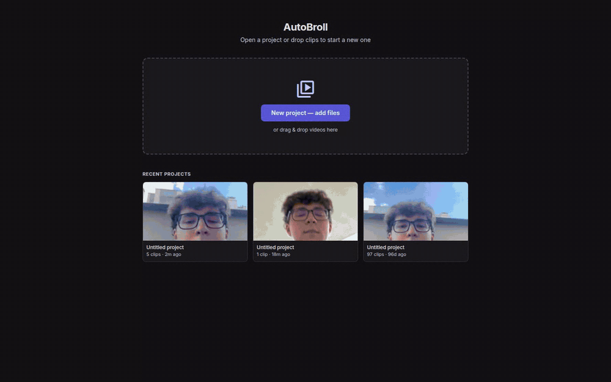
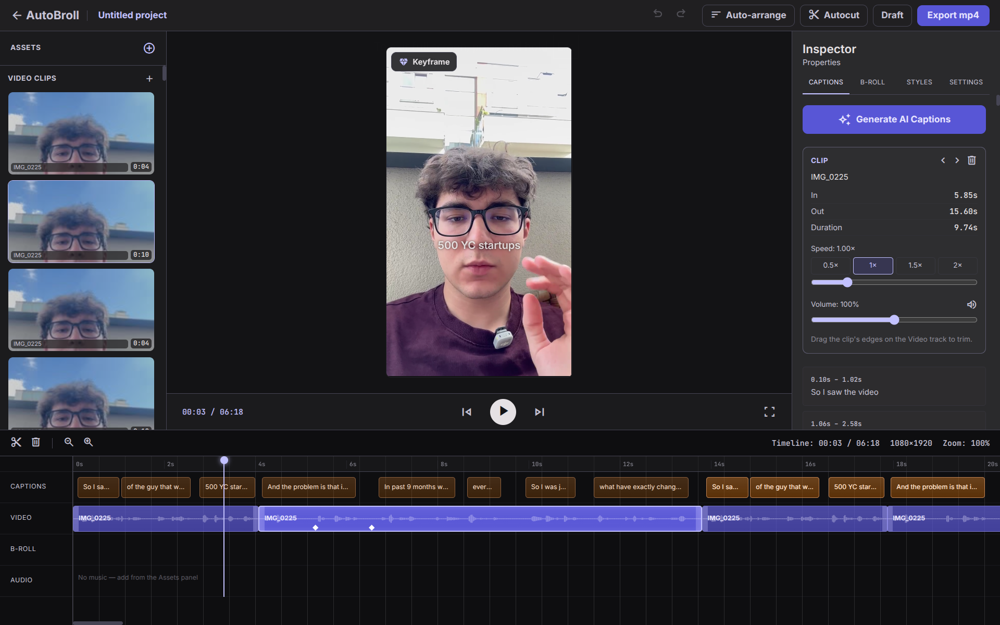

# AutoBroll

An AI short-form video editor that runs in your browser. Drop in your raw takes — it listens to them, puts them in narrative order, cuts the silence, writes human-looking captions, finds B-roll, and lets you polish everything on a CapCut-style timeline. Export to mp4. Built on [Remotion](https://remotion.dev).



*Real session, unedited apart from trimming the waits: three raw takes dropped in, then Auto-arrange → Autocut → Generate Captions → Auto B-roll → play. About 90 seconds end to end on a laptop GPU.*

Most AI caption tools lock subtitles to the bottom, highlight every other word, and slap a box behind them. AutoBroll is the opposite: sparing gold accents on the words that matter, captions placed where they don't cover your face, soft cross-dissolves — output that reads like a human editor cut it by hand.

> Personal tool, shared as-is. Everything runs locally; the only network calls are Gemini (text analysis) and Pexels (stock B-roll search).

## What it does

**AI, one click each:**
- **Auto-arrange** — transcribes every take, orders them into a coherent story, groups retakes of the same line, suggests which duplicates to drop (you confirm)
- **Autocut** — removes silence at the ends *and* long pauses inside every clip (jump-cuts)
- **Generate Captions** — WhisperX word-level transcription → phrase-aware caption pages → Gemini picks the few words worth accenting and looks at one frame per clip to place the block under your chin instead of over your mouth. Re-running never overwrites your manual edits
- **Auto B-roll** — Gemini finds the moments where a visual helps, prefers *your* uploaded footage, falls back to Pexels (with swappable alternatives)

**Editor:**



- Multi-clip timeline: drag to reorder, drag edges to trim, `S` to split at the playhead, waveforms on every clip
- Click anything on the preview to select it; drag corner to resize, drag captions to reposition
- **Keyframes** (CapCut-style flags) for smooth zoom/pan animation per clip
- Per-clip speed (0.25–4×), volume, mute; music with volume/fade and **auto-ducking under voice**
- Caption editing: text, accent words, position, size
- Full undo/redo (⌘Z), autosave, multi-project library
- Export mp4 (frame-accurate Remotion render)

Captions, B-roll and keyframes are **anchored to clips** — reorder, trim, split or speed up a clip and everything moves with it.

## Setup

Requirements: **Node 20+**, **ffmpeg** on PATH, **Python 3.10+** (for WhisperX). An NVIDIA GPU is picked up automatically (float16); without one WhisperX runs on the CPU (int8).

```bash
git clone https://github.com/andriidrok1/autobroll && cd autobroll
npm run setup          # checks tools, creates the WhisperX venv, seeds .env
# npm run setup -- --cpu   ← CPU-only torch (~1 GB instead of ~7 GB) if you have no NVIDIA GPU
```

Then paste your keys into `.env` (both have free tiers): `GEMINI_API_KEY` from [aistudio.google.com/apikey](https://aistudio.google.com/apikey), `PEXELS_API_KEY` from [pexels.com/api](https://www.pexels.com/api/). The Start screen tells you if anything is still missing.

<details><summary>Manual setup</summary>

```bash
npm install
python3 -m venv .venv && .venv/bin/pip install whisperx
cp .env.example .env
```
</details>

## Run

```bash
npm start
```

Open **http://localhost:5173** → drop your clips → Open editor.

A sensible flow: **Auto-arrange** → remove duplicate takes (banner) → **Autocut** → **Generate Captions** → **Auto B-roll** → polish → **Export mp4**.

### Shortcuts

| Key | Action |
|---|---|
| `Space` | play / pause |
| `S` | split clip at playhead |
| `⌘Z` / `⇧⌘Z` | undo / redo |

## Drive it from Claude (MCP)

AutoBroll ships an [MCP](https://modelcontextprotocol.io) server, so Claude Code or Claude Desktop can edit a project by talking: *"cut the pause at 0:12, make the caption about YC bigger and move the B-roll to an inset, then render a draft"*.

```bash
# Claude Code — once, from anywhere:
claude mcp add --scope user autobroll -- node /absolute/path/to/autobroll/mcp/server.mjs
# (inside the repo, Claude Code also picks up .mcp.json automatically)
```

Keep `npm start` running for the AI steps and rendering; pure edits work even with it down. The browser editor reloads the project live whenever Claude saves it, so you can watch the timeline change.

24 tools: `list_projects` · `get_project` · `duplicate_project` · `add_clips` · `reorder_clips` · `trim_clip` · `split_clip` · `set_clip` (speed/volume/mute) · `set_keyframes` · `delete_clips` · `edit_caption` · `add_caption` · `delete_captions` · `search_stock` (Pexels) · `add_broll` · `edit_broll` · `delete_brolls` · `set_music` · `set_accent_color` · `rename_project` · `run_ai_step` (arrange / autocut / captions / broll) · `render` · `frame_at` (Claude looks at a source or rendered frame) · `health`.

Claude works from the transcript, timings and metadata (`get_project`), and can look at individual frames with `frame_at`; it does not watch the video. Last write wins if you and Claude edit the same project at the same moment.

## How it works

```
clips (mp4/mov…) ──► /api/add-clip      ffmpeg remux/encode + thumbnail
                          │
                 WhisperX per clip      word timestamps, cached per clip —
                          │             arrange/captions/autocut share one transcription
              Gemini (structured JSON)  order takes · pick accent words · plan B-roll
                          │
              Remotion composition      clips back-to-back + captions + B-roll +
                          │             music (ducked) + keyframed transforms
                  @remotion/player      live preview in the editor (same component)
                  remotion render       frame-accurate mp4 export
```

- `editor/` — React app (Vite + Tailwind + zustand + @remotion/player)
- `src/` — the Remotion composition (what the player previews *and* the renderer exports)
- `server/` — small Node backend: projects, uploads, waveforms, AI jobs, render
- `scripts/` — AI pipelines (transcribe/arrange/captions/B-roll/autocut) + `gemini.mjs` client
- `mcp/` — MCP server (stdio) exposing the project model and the pipelines to Claude

Face-aware placement sends one 540px frame per source clip to Gemini (`AUTOBROLL_FACE_AWARE=0` turns it off; you can always drag a caption).

Tip: set `AUTOBROLL_PROMPT` in `.env` with your topics/brand names — it biases transcription accuracy for your vocabulary.

Transcription runs once per source file in a single WhisperX process (the model load dominates, so splitting/reordering clips never re-transcribes). Force a device with `AUTOBROLL_DEVICE=cpu` or `cuda` in `.env`; if a CUDA run fails it falls back to the CPU for that job.

## License

MIT
